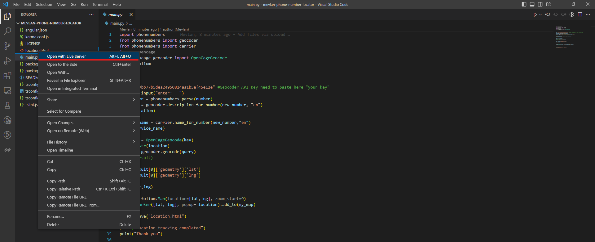

1.  **Aplikimi i Projektit**

**Per te run aplikacionin, fillimisht duhet ta instalojme ate ne qofte
se nuk e kemi bere akoma:**

1.  **Zgjedhim vendin ku ne do e instalojme edhe hapim CMD**

> {width="6.6930555555555555in"
> height="3.4875in"}**(Une po e instaloj ne Desktop)**

2.  {width="6.6930555555555555in"
    height="3.6972222222222224in"}Shtypim \`**git clone**\` edhe me pas
    url e repository ky e kam ruajtur kodin, ne kete rast:
    ***https://github.com/tryMatrix/mevlan-phone-number-locator.git***

{width="6.6930555555555555in"
height="0.8756944444444444in"}

3.  **Hapim folderin me Visual Studio Code**

> **Instaslojme 2 extension qe na duhen ose kalojme ne hapin tjeter nese
> jane tashme te instaluara**
>
> **\* Live Server**
>
> **\* Python**

{width="6.6930555555555555in"
height="2.798611111111111in"}

4.  **Navigojme tek folder dhe instalojme paketat dhe librarite e
    nevojshme per python(ne terminal ose cmd):**

> pip install phonenumbers
>
> pip install folium
>
> pip install geocoder
>
> pip install opencage

5.  {width="6.6930555555555555in"
    height="2.732638888888889in"}**Hapim \`location.html\` me live
    server**

6.  Runojme \`**main.py**\`

{width="4.28125in"
height="1.5416666666666667in"}

{width="6.6930555555555555in"
height="0.8395833333333333in"}
